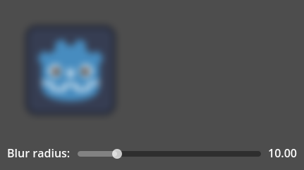

Blur Example in Godot 4
=======================

This is an example of a shader for Gaussian blur in Godot 4.

It works in two passes: first horizontal (X) then vertical (Y). Linear texture filtering is used to cut the number of required texture samples in two. [This article](https://www.rastergrid.com/blog/2010/09/efficient-gaussian-blur-with-linear-sampling/) describes both techniques in detail.

The shader `Blur.gdshader` was generated by the editor script `ShaderGenerator.gd`. This script hardcodes a fixed blur radius into the shader, which can be configured by editing the script.

The radius _can_ be adjusted at runtime with a shader uniform, but this has a few caveats:

1. Choosing a smaller radius does _not_ reduce the number of texture lookups, so it does _not_ improve performance. If you need a blur of a different, fixed radius, it's recommended to generate a different shader for that instead. If you need to turn off the blur, you should just turn off the shader.

2. Choosing a larger radius than what the shader was designed for will result in artifacts, because the shader will start skipping pixels.

3. The linear texture filtering trick is probably not 100% mathematically correct anymore, although visually this doesn't seem to matter.

As such, runtime radius adjustment is mostly useful for fading the shader's effect in and out.
